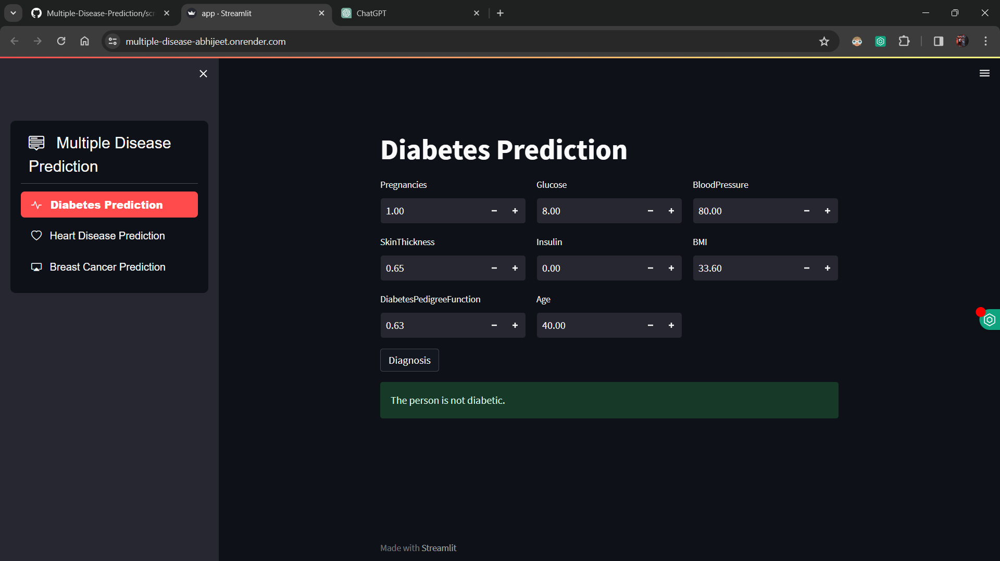
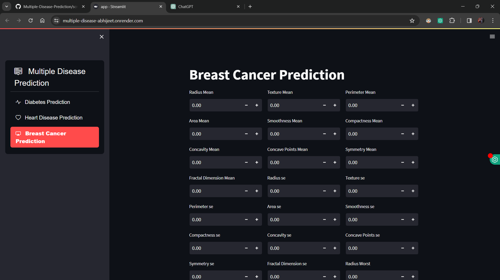

# Multiple Disease Prediction

This project provides a web-based interface for predicting diseases including diabetes, heart disease, and breast cancer using machine learning algorithms.

## Table of Contents

- [Introduction](#introduction)
- [Installation](#installation)
- [Usage](#usage)
- [Screenshots](#screenshots)
- [Contributing](#contributing)
- [License](#license)

## Introduction

The "Multiple Disease Prediction" project provides a user-friendly web-based interface for predicting diseases, including diabetes, heart disease, and breast cancer, using machine learning algorithms. This project aims to leverage the power of data-driven insights to assist healthcare professionals in diagnosing and prognosticating various medical conditions.

The prediction models incorporated into the system have been trained on extensive datasets, ensuring robust performance and accuracy in disease prediction. By inputting relevant medical parameters, users can obtain real-time predictions for the likelihood of specific diseases, empowering them to make informed decisions about patient care and treatment strategies.

With a focus on usability and accessibility, the project serves as a valuable tool for medical practitioners, researchers, and individuals seeking to monitor their health status. By harnessing the capabilities of machine learning and web technologies, the "Multiple Disease Prediction" project contributes to advancing healthcare practices and promoting proactive disease management.


## Installation

1. Clone the repository:

    ```bash
    git clone https://github.com/your_username/your_repository.git
    ```

2. Install dependencies:

    ```bash
    pip install -r requirements.txt
    ```

## Usage

1. Run the following command to start the web application:

    ```bash
    streamlit run app.py
    ```

2. Use the sidebar to select the disease you want to predict.

3. Enter the required parameters in the input fields.

4. Click on the "Diagnosis" button to get the prediction result.

## Screenshots





<!-- Add more screenshots as needed -->

## Contributing

Contributions are welcome! Please fork the repository and create a pull request with your proposed changes.

## License

This project is licensed under the [MIT License](LICENSE).
